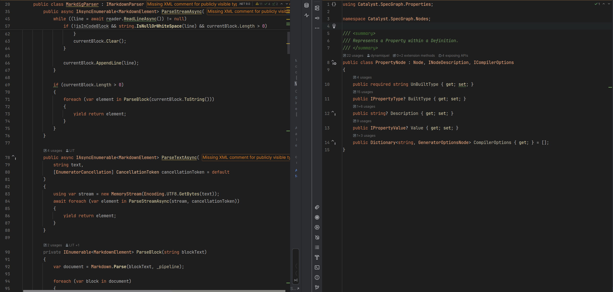

# Ember Theme

A warm, dark IDE theme that prioritises syntax clarity and avoids all cool colors.

## 🔥 About Ember

Ember is a dark theme born from a simple idea: code environments should be **cozy and warm**, not cold and sterile. It's built around a palette of ambers, oranges, deep reds, and earthy tones, completely avoiding blues, purples, and harsh cool colors.

The name "Ember" evokes the feeling of a glowing coal—dark, but providing a comfortable, steady warmth.

### The Philosophy: Clarity First

Many "warm" themes can feel muddy or flat, causing different parts of the syntax to blend together. The core intention of Ember is to solve this by maintaining **high clarity** and **useful color differentiation**.

* **Warm, not Washed Out:** Colors are chosen to be pleasant and warm, but are saturated and distinct enough to provide meaningful syntax highlighting.
* **Functional Contrast:** The background is dark enough for comfort, while the foreground text has purposeful contrast to remain legible for long coding sessions.
* **Purposeful Color:** Keywords, variables, functions, and strings all have distinct, logical colors, ensuring that the theme's warmth *enhances* your workflow, rather than hiding it.

## 📦 Supported Applications

This repository currently contains theme files for:

* **JetBrains IDEs** (e.g., Rider, IntelliJ, PyCharm, WebStorm)
* **Zed**
* **VS Code** (this includes VS Code forks, such as Cursor, Windsurf etc.)

## 💾 Installation

### JetBrains IDEs

*Note: it has only currently been tested on Rider 2025.*

1.  Download the [JetBrains theme file](jetbrains/ember.icls) from this repository.
2.  Drag and drop the downloaded file into your IDE window.
3.  Press `Install`.

### Zed

*Note: the Zed theme is not feature-parity with the JetBrains theme due to Zed limitations.*

1.  Download the [Zed theme file](zed/ember.json) from this repository.
2.  Place it under the Zed themes directory (`~/.config/zed/themes` on Linux)
3.  In Zed, open the command palette (`Ctrl+Shift+P`).
4.  Run the `theme selector` command.
5.  Select `Ember`.

### VS Code

*Note: the VS Code theme is not feature-parity with the JetBrains theme due to limitations and time.*

1.  Download the [VSIX file](vscode/ember-0.0.1.vsix) from this repository.
2.  In VS Code, open the command palette (`Ctrl+Shift+P`).
3.  Run the `Extensions: Install from VSIX...` command.
4.  Select the downloaded VSIX file.

## 📄 License

This theme is licensed under the [Apache License](LICENSE).
